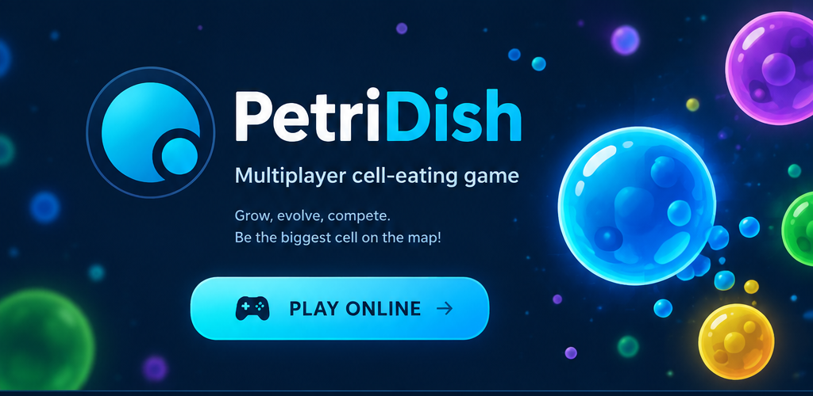

 

**[Download page · Страница загрузок](https://petridish-org.github.io/PetriDishJavaClient/)**

### Download the client · Скачать клиент

Choose your platform · Выбери свою платформу

<b>Other versions</b> — Java, stores and more · <b>Другие версии</b> — Java, сторы и прочее

 

Every past build stays on its own [release page](https://github.com/petridish-org/PetriDishJavaClient/releases). 
Каждая прошлая сборка остаётся на [своей странице релиза](https://github.com/petridish-org/PetriDishJavaClient/releases).

### Mirrors · Зеркала

If the main download is unavailable, try one of these. 
Если основная загрузка недоступна, попробуй одно из этих.

| Downloads · Загрузки | Game site · Сайт игры |
| :---: | :---: |
| [pc.petridish.pw](https://pc.petridish.pw) | [petridish.pw](https://petridish.pw) |
| [pc.bact.io](https://pc.bact.io) | [petri.bact.io](https://petri.bact.io) |

---

## English

Windows needs no installer — download and run. On Android and iOS the store versions
update themselves; the `.apk` is only for phones too old for Google Play (Android 5.1+).
The `.jar` runs anywhere Java is installed.

| File | What it is |
| --- | --- |
| `PetriDishJ500.exe` | Windows, self-contained, no installer |
| `PetriDish-5.0.0-arm64.dmg` | macOS on Apple Silicon (M1 and newer) |
| `PetriDish-5.0.0-x64.dmg` | macOS on Intel |
| `PetriDish-desktop-min.jar` | any system with Java installed |
| `PetriDish-android-legacy-version.apk` | Android 5.1+, installed by hand |

The Java and Android file names never change, so those two links always point at the
newest release. The Windows and macOS names carry the version number, so those buttons
are repointed with every release.

This repository hosts release binaries only — the game source code is not published here.

## Русский

Windows-сборка работает без установки — скачать и запустить. На Android и iOS версии из
сторов обновляются сами; `.apk` нужен только для телефонов, которым Google Play уже не
доступен (Android 5.1+). `.jar` запускается везде, где есть Java.

| Файл | Что это |
| --- | --- |
| `PetriDishJ500.exe` | Windows, всё внутри, установка не нужна |
| `PetriDish-5.0.0-arm64.dmg` | macOS на Apple Silicon (M1 и новее) |
| `PetriDish-5.0.0-x64.dmg` | macOS на Intel |
| `PetriDish-desktop-min.jar` | любая система, где установлена Java |
| `PetriDish-android-legacy-version.apk` | Android 5.1+, установка вручную |

Имена файлов Java и Android не меняются, поэтому эти две ссылки всегда ведут на самый
новый релиз. В именах Windows и macOS есть номер версии, поэтому эти кнопки
перенацеливаются на каждый новый релиз.

Здесь лежат только готовые сборки — исходный код игры не публикуется.

 
💙 Play together. Grow together.

