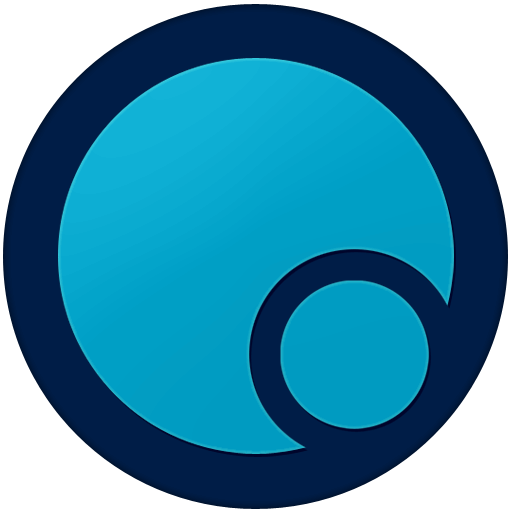

# PetriDish

**Multiplayer cell-eating game — official client builds** 
Многопользовательская игра про поедание клеток — официальные сборки клиента

 

### Download · Скачать

**[pc.petridish.pw](https://pc.petridish.pw)** · mirror / зеркало **[pc.bact.io](https://pc.bact.io)** · [petridish.pw](https://petridish.pw)

---

## English

Windows needs no installer — download and run. On Android and iOS the store versions
above update themselves; the `.apk` is only for phones too old for Google Play
(Android 5.1+). The `.jar` runs anywhere Java is installed.

| File | What it is |
| --- | --- |
| `PetriDishJ.exe` | Windows, self-contained, no installer |
| `PetriDish-5.0.0-arm64.dmg` | macOS on Apple Silicon (M1 and newer) |
| `PetriDish-5.0.0-x64.dmg` | macOS on Intel |
| `PetriDish-desktop-min.jar` | any system with Java installed |
| `PetriDish-android-legacy-version.apk` | Android 5.1+, installed by hand |

The Windows, Java and Android links always point at the newest release. macOS file
names carry the version, so those two are refreshed with every release.

This repository hosts release binaries only — the game source code is not published
here. Every build stays available on its own
[release page](https://github.com/petridish-org/PetriDishJavaClient/releases).

## Русский

Windows-сборка работает без установки — скачать и запустить. На Android и iOS версии
из сторов обновляются сами; `.apk` нужен только для телефонов, которым Google Play уже
не доступен (Android 5.1+). `.jar` запускается везде, где есть Java.

| Файл | Что это |
| --- | --- |
| `PetriDishJ.exe` | Windows, всё внутри, установка не нужна |
| `PetriDish-5.0.0-arm64.dmg` | macOS на Apple Silicon (M1 и новее) |
| `PetriDish-5.0.0-x64.dmg` | macOS на Intel |
| `PetriDish-desktop-min.jar` | любая система, где установлена Java |
| `PetriDish-android-legacy-version.apk` | Android 5.1+, установка вручную |

Ссылки на Windows, Java и Android всегда ведут на самый новый релиз. В именах файлов
macOS есть номер версии, поэтому эти две обновляются с каждым релизом.

Здесь лежат только готовые сборки — исходный код игры не публикуется. Каждая сборка
остаётся доступной на своей
[странице релиза](https://github.com/petridish-org/PetriDishJavaClient/releases).
